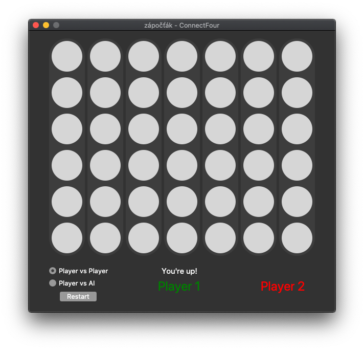

# ConnectFour

ConnectFour game written in Python with MiniMax AI.

# Features

- GUI written in Tkinter
- AI (MiniMax with Alpha-beta pruning)
- PvP / AI vs Player game mode

# Features

The objective of the game is to place 4 stones in a row(vertically/horizontally/diagonal) before the opponent does.

The game is controlled by GUI. You play with the mouse by selecting the column in which to throw your stone. 

The AI has been implemented using alpha-beta pruning, where the heuristic is based on counting how many stones in a row the player has placed

